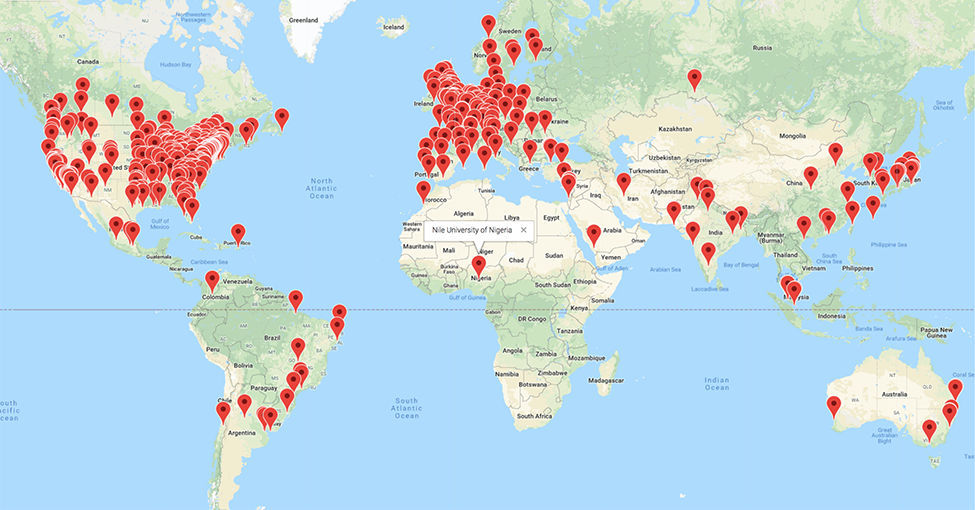

```{r setup, include=FALSE}
if(!("revealjs" %in% installed.packages()[,1])) {
  install.packages("revealjs") }
require("revealjs")
require("DiagrammeR")

knitr::opts_chunk$set(echo = FALSE)
```

---


</br>


---

## Optic flow informs action

<iframe width="560" height="315" src="https://www.youtube.com/embed/o27tIdYggY0" frameborder="0" allow="autoplay; encrypted-media" allowfullscreen></iframe>

---

<video data-autoplay width="600" controls>
  <source src="https://nyu.databrary.org/slot/9825/-/asset/11645/download?inline=true" type="video/mp4">
  Your browser does not support the video tag.
</video>

## Optic flow perception develops slowly

<div class="centered">


</br>
<small>
([Adamiak et al., 2015](http://doi.org/10.1167/15.12.1008))
</small>
</div>

## So do brain responses...

<div class="centered">


</br>
<small>([Gilmore et al., 2015](https://doi.org/10.1371/journal.pone.0157911))</small>
</div>

## Infants' visual experiences ≠ adults'

<div class="centered">

</br>
<video data-autoplay width="400" controls>
  <source src="https://nyu.databrary.org/slot/7740/0,24634/asset/16751/download?inline=true" type="video/mp4">
  Your browser does not support the video tag.
</video>
<video data-autoplay width="400" controls>
  <source src="https://nyu.databrary.org/slot/7739/0,26134/asset/16749/download?inline=true" type="video/mp4">
  Your browser does not support the video tag.
</video>
</br>
<small>
([Gilmore et al., 2015](http://doi.org/10.17910/B7.116))
</small>
</div>

---

<video data-autoplay width="600" controls>
  <source src="https://nyu.databrary.org/slot/11680/25500,50000/asset/41873/download?inline=true" type="video/mp4">
  Your browser does not support the video tag.
</video>
</br>
<video data-autoplay width="600" controls>
  <source src="https://nyu.databrary.org/slot/11680/51000,75500/asset/41875/download?inline=true" type="video/mp4">
  Your browser does not support the video tag.
</video>

## Infants experience *faster* speeds 

<div class="centered">

</br>
<small>
([Raudies & Gilmore, 2014](http://doi.org/10.1162/NECO_a_00645))
</small>
</div>

---

<video data-autoplay width="600" controls>
  <source src="https://nyu.databrary.org/slot/11630/1567557,1747248/asset/39854/download?inline=true
" type="video/mp4">
  Your browser does not support the video tag.
</video>
</br>
[Jayaraman et al., 2014](http://doi.org/10.17910/B7988V)

---

<div class="centered">


</br>
<small>
([Gilmore et al, 2015](http://doi.org/10.1109/DEVLRN.2015.7345450))
</small>
</div>

## and *linear* motion >> radial or rotational

<div class="centered">

</br>
<small>
([Gilmore et al, 2015](http://doi.org/10.1109/DEVLRN.2015.7345450))
</small>
</div>

## Why? *Posture* changes the input

| Parameter | Crawling Infant | Walking Infant |
|-----------|-----------------|----------------|
| Eye height| 0.30 m          | 0.60 m         |
| Locomotor speed | 0.33 m/s  | 0.61 m/s       |
| Head tilt | 20 deg          | 9 deg          |

<div class="centered">
</br>

</br>
<small>
([Kretch et al., 2014](http://dx.doi.org/10.1111/cdev.12206))
</small>
</div>

---

<div class="centered">

</br>
<small>
([Gilmore et al, 2015](http://doi.org/10.1109/DEVLRN.2015.7345450))
</small>
</div>

---


---

<a href="http://databrary.org">



</a>

## Keep in touch {.vcenter .flexbox}

### rogilmore@psu.edu
### [gilmore-lab.github.io](http://gilmore-lab-github.io)

## Stack

This talk was produced on `r Sys.Date()` in [RStudio](http://rstudio.com) using R Markdown and the reveal.JS framework.
The code and materials used to generate the slides may be found at <https://github.com/gilmore-lab/2018-02-24-devel-recruit/>.
Information about the R Session that produced the code is as follows:

```{r session-info}
sessionInfo()
```
